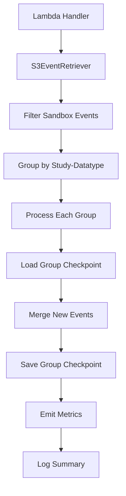

# Design Document: Checkpoint Filtering and Grouping

## Overview

This design extends the Event Log Checkpoint Lambda to support filtering sandbox projects and grouping checkpoint data by study-datatype combinations. The current implementation processes all events into a single checkpoint file. This enhancement will:

1. Filter out events from sandbox projects (project_label matching "sandbox-*")
2. Group events by both study and datatype fields
3. Create independent checkpoint files for each study-datatype combination
4. Enable configurable checkpoint paths via template with {study} and {datatype} placeholders

The design maintains the existing architecture while introducing new filtering and grouping components that integrate seamlessly with the current Checkpoint, CheckpointStore, and S3EventRetriever classes.

## Architecture

### High-Level Flow



### Component Responsibilities

**EventFilter** (new component):
- Filters events based on project_label patterns
- Provides sandbox project detection logic
- Returns filtered events and filter statistics

**EventGrouper** (new component):
- Groups events by study and datatype fields
- Returns dictionary mapping (study, datatype) tuples to event lists
- Provides grouping statistics

**CheckpointKeyTemplate** (new component):
- Validates and parses CHECKPOINT_KEY_TEMPLATE environment variable
- Generates checkpoint keys from study-datatype combinations
- Ensures required placeholders are present

**Lambda Handler** (modified):
- Orchestrates filtering, grouping, and checkpoint processing
- Manages independent checkpoint operations per study-datatype
- Handles partial failures gracefully
- Emits CloudWatch metrics and structured logs

### Integration Points

The new components integrate with existing architecture:

1. **S3EventRetriever** → **EventFilter**: Filter retrieved events before grouping
2. **EventFilter** → **EventGrouper**: Group filtered events by study-datatype
3. **EventGrouper** → **CheckpointStore**: Create separate CheckpointStore per group
4. **CheckpointKeyTemplate** → **CheckpointStore**: Generate S3 keys for each group

## Components and Interfaces

### EventFilter

Filters events based on project_label patterns.

```python
class EventFilter:
    """Filters events based on project label patterns."""
    
    @staticmethod
    def is_sandbox_project(project_label: str) -> bool:
        """Check if project label matches sandbox pattern.
        
        Args:
            project_label: Project label from event
            
        Returns:
            True if project label starts with "sandbox-"
        """
        pass
    
    @staticmethod
    def filter_sandbox_events(
        events: List[VisitEvent]
    ) -> Tuple[List[VisitEvent], int]:
        """Filter out sandbox project events.
        
        Args:
            events: List of events to filter
            
        Returns:
            Tuple of (filtered_events, filtered_count)
            - filtered_events: Events not matching sandbox pattern
            - filtered_count: Number of events filtered out
        """
        pass
```

**Design Decisions**:
- Static methods for stateless filtering logic
- Returns both filtered events and count for metrics/logging
- Simple string prefix matching for sandbox detection
- No configuration needed - pattern is fixed ("sandbox-*")

### EventGrouper

Groups events by study and datatype combinations.

```python
from typing import Dict, Tuple

StudyDatatypeKey = Tuple[str, str]  # (study, datatype)

class EventGrouper:
    """Groups events by study and datatype combinations."""
    
    @staticmethod
    def group_by_study_datatype(
        events: List[VisitEvent]
    ) -> Dict[StudyDatatypeKey, List[VisitEvent]]:
        """Group events by study and datatype.
        
        Args:
            events: List of events to group
            
        Returns:
            Dictionary mapping (study, datatype) to list of events
            Example: {
                ("adrc", "form"): [event1, event2, ...],
                ("adrc", "dicom"): [event3, event4, ...],
                ("dvcid", "form"): [event5, ...]
            }
        """
        pass
```

**Design Decisions**:
- Static method for stateless grouping logic
- Uses tuple (study, datatype) as dictionary key for clarity
- Type alias StudyDatatypeKey improves readability
- Returns standard Python dict for easy iteration
- **Grouping happens at the VisitEvent level (before DataFrame conversion)**

**Grouping and DataFrame Relationship**:

The grouping strategy works with the existing Checkpoint architecture:

1. **Grouping Phase** (operates on VisitEvent objects):
   ```python
   # Input: List[VisitEvent] (all events from S3)
   all_events = retriever.retrieve_and_validate_events()
   
   # Group by (study, datatype) - still working with VisitEvent objects
   grouped_events = EventGrouper.group_by_study_datatype(all_events)
   # Result: Dict[(study, datatype), List[VisitEvent]]
   ```

2. **Per-Group Processing** (converts to DataFrame):
   ```python
   for (study, datatype), events in grouped_events.items():
       # Load existing checkpoint for this study-datatype
       checkpoint_store = CheckpointStore(bucket, key_for_study_datatype)
       existing_checkpoint = checkpoint_store.get_checkpoint()
       
       # Create new checkpoint from events (converts to DataFrame internally)
       new_checkpoint = Checkpoint.from_events(events)
       
       # Merge with existing checkpoint (DataFrame operations)
       merged_checkpoint = existing_checkpoint.add_events(events)
       
       # Save merged checkpoint (DataFrame written as parquet)
       checkpoint_store.save(merged_checkpoint)
   ```

3. **Why Group Before DataFrame Conversion**:
   - **Simplicity**: Grouping VisitEvent objects is straightforward Python dict operations
   - **Existing API**: `Checkpoint.from_events()` already handles VisitEvent → DataFrame conversion
   - **Memory Efficiency**: Only convert events to DataFrame when needed for checkpoint operations
   - **Clear Separation**: Grouping logic is independent of DataFrame operations

4. **Alternative Approach (Not Chosen)**:
   - Could convert all events to single DataFrame, then use Polars groupby
   - Rejected because: More complex, requires changes to Checkpoint API, less clear separation of concerns

### CheckpointKeyTemplate

Validates and generates checkpoint keys from templates.

```python
class CheckpointKeyTemplate:
    """Validates and generates checkpoint keys from templates."""
    
    def __init__(self, template: str):
        """Initialize with template string.
        
        Args:
            template: Template string with {study} and {datatype} placeholders
            
        Raises:
            ValueError: If template is missing required placeholders
        """
        pass
    
    def validate(self) -> None:
        """Validate template has required placeholders.
        
        Raises:
            ValueError: If template missing {study} or {datatype}
        """
        pass
    
    def generate_key(self, study: str, datatype: str) -> str:
        """Generate checkpoint key for study-datatype combination.
        
        Args:
            study: Study identifier (e.g., "adrc", "dvcid")
            datatype: Datatype identifier (e.g., "form", "dicom")
            
        Returns:
            Checkpoint key with placeholders replaced
            Example: "checkpoints/adrc/form/events.parquet"
        """
        pass
```

**Design Decisions**:
- Validates template at initialization (fail fast)
- Uses Python string format() for placeholder replacement
- Raises ValueError for invalid templates (clear error messages)
- Immutable after initialization (template stored as instance variable)

### Modified Lambda Handler

The Lambda handler orchestrates the complete workflow.

```python
def lambda_handler(event: dict, context: Any) -> dict:
    """Lambda handler for checkpoint processing with filtering and grouping.
    
    Workflow:
    1. Load configuration (bucket, prefix, template)
    2. Retrieve events from S3
    3. Filter sandbox events
    4. Group by study-datatype
    5. Process each group independently:
       - Load existing checkpoint
       - Merge new events
       - Save updated checkpoint
    6. Emit metrics and logs
    
    Args:
        event: Lambda event (unused for scheduled invocation)
        context: Lambda context
        
    Returns:
        Response dict with processing summary
    """
    pass
```

**Key Changes**:
1. Load CHECKPOINT_KEY_TEMPLATE from environment
2. Filter events before grouping
3. Iterate over study-datatype groups
4. Create separate CheckpointStore per group
5. Handle partial failures (continue processing other groups)
6. Emit metrics per group and aggregate
7. Log structured summary with group details

## Data Models

### Existing Models (No Changes)

**VisitEvent**: Pydantic model for event validation (defined in models.py)
- Contains study and datatype fields used for grouping
- Contains project_label field used for filtering

**Checkpoint**: Encapsulates checkpoint data (defined in checkpoint.py)
- No changes needed - works with any subset of events

**CheckpointStore**: Handles S3 read/write (defined in checkpoint_store.py)
- No changes needed - already supports configurable keys

### New Type Aliases

```python
# Type alias for study-datatype grouping key
StudyDatatypeKey = Tuple[str, str]  # (study, datatype)

# Type alias for grouped events
GroupedEvents = Dict[StudyDatatypeKey, List[VisitEvent]]
```

### Configuration Model

```python
from pydantic import BaseModel, Field

class LambdaConfig(BaseModel):
    """Configuration for Lambda execution."""
    
    bucket: str = Field(description="S3 bucket for event logs and checkpoints")
    prefix: str = Field(default="", description="S3 prefix for event logs")
    checkpoint_key_template: str = Field(
        description="Template for checkpoint keys with {study} and {datatype}"
    )
    
    def validate_template(self) -> None:
        """Validate checkpoint key template has required placeholders."""
        if "{study}" not in self.checkpoint_key_template:
            raise ValueError("Template missing {study} placeholder")
        if "{datatype}" not in self.checkpoint_key_template:
            raise ValueError("Template missing {datatype} placeholder")
```

**Design Decisions**:
- Use Pydantic for configuration validation
- Fail fast on missing or invalid configuration
- Provide clear error messages for operators
- Default empty prefix for backward compatibility

## Error Handling

### Filtering Errors

**Scenario**: Invalid project_label format
- **Handling**: Log warning, include event in processing (fail open)
- **Rationale**: Filtering is defensive - don't block valid events

### Grouping Errors

**Scenario**: Missing study or datatype field
- **Handling**: Should not occur (Pydantic validation ensures fields exist)
- **Fallback**: If it occurs, log error and skip event

### Template Validation Errors

**Scenario**: Missing required placeholders
- **Handling**: Raise ValueError at Lambda initialization
- **Rationale**: Fail fast - invalid configuration should prevent execution

**Scenario**: Template generates invalid S3 key
- **Handling**: CheckpointStore will raise CheckpointError
- **Rationale**: Let S3 client validate key format

### Checkpoint Operation Errors

**Scenario**: One study-datatype checkpoint fails to save
- **Handling**: Log error, continue processing other groups
- **Rationale**: Independent checkpoint management - one failure shouldn't block others

**Scenario**: All checkpoints fail to save
- **Handling**: Lambda returns error status
- **Rationale**: Complete failure should trigger retry

### Partial Failure Response

```python
{
    "statusCode": 207,  # Multi-Status
    "body": {
        "total_events": 150,
        "filtered_events": 10,
        "groups_processed": 3,
        "groups_failed": 1,
        "successful_groups": [
            {"study": "adrc", "datatype": "form", "events": 80},
            {"study": "adrc", "datatype": "dicom", "events": 40}
        ],
        "failed_groups": [
            {"study": "dvcid", "datatype": "form", "error": "S3 write failed"}
        ]
    }
}
```

## Logging Strategy

### Structured Logging with Lambda Powertools

Use AWS Lambda Powertools Logger for structured logging with consistent context.

```python
from aws_lambda_powertools import Logger

logger = Logger(service="event-log-checkpoint")
```

### Log Events

**Filtering**:
```python
logger.info(
    "Filtered sandbox events",
    extra={
        "total_events": len(all_events),
        "filtered_count": filtered_count,
        "remaining_events": len(filtered_events)
    }
)
```

**Grouping**:
```python
logger.info(
    "Grouped events by study-datatype",
    extra={
        "group_count": len(grouped_events),
        "groups": [
            {"study": study, "datatype": datatype, "event_count": len(events)}
            for (study, datatype), events in grouped_events.items()
        ]
    }
)
```

**Checkpoint Operations**:
```python
logger.info(
    "Saved checkpoint",
    extra={
        "study": study,
        "datatype": datatype,
        "checkpoint_key": checkpoint_key,
        "event_count": checkpoint.get_event_count()
    }
)
```

**Errors**:
```python
logger.error(
    "Failed to save checkpoint",
    extra={
        "study": study,
        "datatype": datatype,
        "checkpoint_key": checkpoint_key,
        "error": str(e)
    },
    exc_info=True
)
```

**Summary**:
```python
logger.info(
    "Checkpoint processing complete",
    extra={
        "total_events_retrieved": total_events,
        "filtered_count": filtered_count,
        "groups_processed": successful_groups,
        "groups_failed": failed_groups,
        "execution_time_ms": execution_time
    }
)
```

## Metrics Strategy

### CloudWatch Metrics with Lambda Powertools

Use AWS Lambda Powertools Metrics for CloudWatch integration.

```python
from aws_lambda_powertools import Metrics
from aws_lambda_powertools.metrics import MetricUnit

metrics = Metrics(namespace="EventLogCheckpoint", service="checkpoint-lambda")
```

### Metric Definitions

**EventsFiltered**:
- **Type**: Count
- **Dimensions**: None
- **Description**: Number of sandbox events filtered out

```python
metrics.add_metric(
    name="EventsFiltered",
    unit=MetricUnit.Count,
    value=filtered_count
)
```

**EventsProcessedByStudyDatatype**:
- **Type**: Count
- **Dimensions**: Study, Datatype
- **Description**: Number of events processed per study-datatype combination

```python
metrics.add_dimension(name="Study", value=study)
metrics.add_dimension(name="Datatype", value=datatype)
metrics.add_metric(
    name="EventsProcessedByStudyDatatype",
    unit=MetricUnit.Count,
    value=len(events)
)
```

**CheckpointsSaved**:
- **Type**: Count
- **Dimensions**: None
- **Description**: Number of checkpoints successfully saved

```python
metrics.add_metric(
    name="CheckpointsSaved",
    unit=MetricUnit.Count,
    value=1
)
```

**CheckpointSaveFailures**:
- **Type**: Count
- **Dimensions**: Study, Datatype
- **Description**: Number of checkpoint save failures

```python
metrics.add_dimension(name="Study", value=study)
metrics.add_dimension(name="Datatype", value=datatype)
metrics.add_metric(
    name="CheckpointSaveFailures",
    unit=MetricUnit.Count,
    value=1
)
```

### Metric Emission Pattern

```python
@metrics.log_metrics(capture_cold_start_metric=True)
def lambda_handler(event: dict, context: Any) -> dict:
    # Processing logic
    
    # Emit filtering metrics
    metrics.add_metric(name="EventsFiltered", unit=MetricUnit.Count, value=filtered_count)
    
    # Emit per-group metrics
    for (study, datatype), events in grouped_events.items():
        metrics.add_dimension(name="Study", value=study)
        metrics.add_dimension(name="Datatype", value=datatype)
        metrics.add_metric(
            name="EventsProcessedByStudyDatatype",
            unit=MetricUnit.Count,
            value=len(events)
        )
    
    # Metrics automatically flushed at function exit
    return response
```


## Correctness Properties

A property is a characteristic or behavior that should hold true across all valid executions of a system—essentially, a formal statement about what the system should do. Properties serve as the bridge between human-readable specifications and machine-verifiable correctness guarantees.

### Property 1: Sandbox Event Filtering

*For any* list of events, after filtering, all remaining events should have project_label values that do not start with "sandbox-".

**Validates: Requirements 1.1, 1.2, 1.3, 1.4**

**Rationale**: This property ensures that the filtering logic correctly excludes all sandbox projects while preserving all non-sandbox events. By testing with randomly generated events containing various project_label patterns, we verify the filter works correctly across all possible inputs.

### Property 2: Event Grouping Completeness

*For any* list of events, grouping by study-datatype should partition all events such that:
- Every event appears in exactly one group
- Events in the same group have identical study and datatype values
- No events are lost or duplicated

**Validates: Requirements 2.1**

**Rationale**: This property ensures the grouping function correctly partitions events without losing or duplicating any. It verifies that the grouping is both complete (all events included) and correct (events grouped by the right criteria).

### Property 3: Template Key Generation

*For any* valid study and datatype strings, the template "checkpoints/{study}/{datatype}/events.parquet" should generate a key in the format "checkpoints/{study}/{datatype}/events.parquet" with placeholders replaced by the actual values.

**Validates: Requirements 2.2, 2.3, 2.4, 2.5, 2.6**

**Rationale**: This property ensures template expansion works correctly for all study-datatype combinations. By testing with randomly generated study and datatype values, we verify the template mechanism produces correctly formatted keys.

### Property 4: Checkpoint Operation Independence

*For any* two different study-datatype combinations, loading or saving a checkpoint for one combination should not affect the state of checkpoints for other combinations.

**Validates: Requirements 3.1, 3.3**

**Rationale**: This property ensures checkpoints are truly independent. Operations on one checkpoint should not have side effects on other checkpoints, enabling parallel processing and isolated failure handling.

### Property 5: Checkpoint Timestamp Independence

*For any* study-datatype combination, the last processed timestamp returned by a checkpoint should be determined solely by events in that specific checkpoint, not by events in other checkpoints.

**Validates: Requirements 3.2**

**Rationale**: This property ensures each checkpoint maintains its own processing state. The timestamp for one study-datatype combination should not be influenced by timestamps from other combinations.

### Property 6: Partial Failure Isolation

*For any* set of study-datatype groups where one group's checkpoint save operation fails, all other groups' checkpoints should still be saved successfully.

**Validates: Requirements 3.4**

**Rationale**: This property ensures failures are isolated. One checkpoint failure should not prevent other checkpoints from being saved, enabling graceful degradation and partial success.

### Property 7: New Checkpoint Processing

*For any* study-datatype combination with no existing checkpoint, all events for that combination should be processed (no timestamp filtering applied).

**Validates: Requirements 3.5**

**Rationale**: This property ensures new checkpoints start from a clean state. When no checkpoint exists, the system should process all historical events rather than skipping any based on timestamps.

### Property 8: Template Validation

*For any* template string, validation should succeed if and only if the template contains both "{study}" and "{datatype}" placeholders.

**Validates: Requirements 4.1, 4.4**

**Rationale**: This property ensures configuration validation is correct. Templates must contain required placeholders to function properly, and validation should catch missing placeholders before execution.

## Testing Strategy

### Dual Testing Approach

This feature requires both unit tests and property-based tests for comprehensive coverage:

**Unit Tests** focus on:
- Specific examples of sandbox filtering (e.g., "sandbox-form", "ingest-form")
- Specific template expansions (e.g., "adrc/form/events.parquet")
- Logging output verification (structured log format and content)
- Metrics emission verification (CloudWatch metric names and dimensions)
- Error handling for specific failure scenarios
- Integration between components

**Property-Based Tests** focus on:
- Universal properties across all possible inputs
- Filtering correctness for any project_label pattern
- Grouping correctness for any event distribution
- Template expansion for any study-datatype combination
- Checkpoint independence for any combination of operations
- Validation logic for any template string

### Property-Based Testing Configuration

**Library**: Hypothesis (Python property-based testing library)

**Configuration**:
- Minimum 100 iterations per property test
- Each test tagged with feature name and property number
- Tag format: `# Feature: checkpoint-filtering-and-grouping, Property N: {property_text}`

**Example Property Test Structure**:

```python
from hypothesis import given, strategies as st
import pytest

# Feature: checkpoint-filtering-and-grouping, Property 1: Sandbox Event Filtering
@given(events=st.lists(st.builds(VisitEvent, ...)))
@pytest.mark.property_test
def test_sandbox_filtering_property(events):
    """Property: All filtered events should not match sandbox pattern."""
    filtered_events, _ = EventFilter.filter_sandbox_events(events)
    
    for event in filtered_events:
        assert not event.project_label.startswith("sandbox-")
```

### Test Organization

```
lambda/event_log_checkpoint/test/python/
├── test_event_filter.py           # Unit + property tests for EventFilter
├── test_event_grouper.py          # Unit + property tests for EventGrouper
├── test_checkpoint_key_template.py # Unit + property tests for template
├── test_lambda_handler.py         # Integration tests for handler
└── test_properties.py             # Additional property-based tests
```

### Coverage Goals

- Unit test coverage: 90%+ for new components
- Property test coverage: All 8 correctness properties implemented
- Integration test coverage: End-to-end workflows with multiple groups
- Error handling coverage: All error paths tested

### Testing Priorities

1. **Critical Path**: Filtering and grouping logic (Properties 1, 2)
2. **Configuration**: Template validation and key generation (Properties 3, 8)
3. **Independence**: Checkpoint isolation (Properties 4, 5, 6, 7)
4. **Observability**: Logging and metrics (unit tests only)
5. **Integration**: End-to-end Lambda handler workflow

