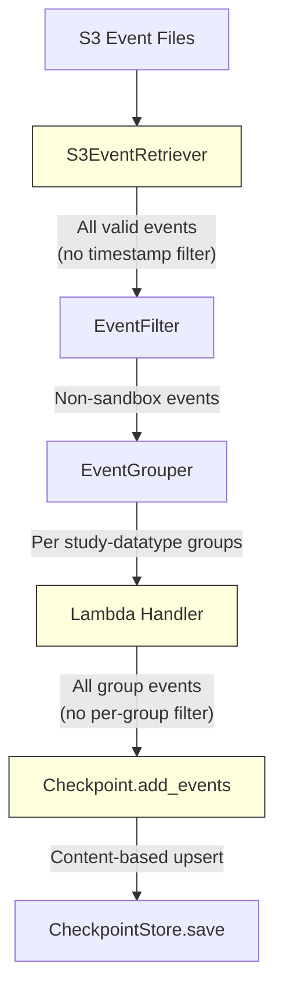

# Design Document: Content-Based Deduplication

## Overview

This design replaces timestamp-based event filtering with content-based deduplication using upsert semantics in the checkpoint lambda. The current implementation drops backfilled events because it filters by event timestamp at two points: in `S3EventRetriever.should_process_event()` and in the per-group timestamp filter in `lambda_function.py`. The new approach deduplicates at merge time using event identity fields, allowing all events—including backfills—to be correctly processed.

The key insight is that deduplication should happen at content level (same event identity = duplicate) rather than temporal level (older timestamp = already processed). This enables:
- Backfilled events with old timestamps to be merged correctly
- Corrected events to replace their existing versions (upsert)
- True duplicates to be skipped without data bloat

## Architecture

The change is localized to three components within the checkpoint lambda:



**Changed components** (highlighted):
1. **S3EventRetriever** — Remove `should_process_event` method; `_fetch_and_validate` no longer calls it
2. **Lambda Handler** — Remove per-group timestamp filter that skips events with `timestamp <= since_timestamp`
3. **Checkpoint.add_events** — Replace simple concatenation with content-based upsert logic

**Unchanged components**:
- S3 LastModified pre-filter in `list_event_files()` (performance optimization, retained)
- EventFilter (sandbox filtering)
- EventGrouper (study-datatype partitioning)
- CheckpointStore (read/write parquet)
- VisitEvent model (validation)

## Components and Interfaces

### 1. Checkpoint.add_events (Modified)

**Current signature** (unchanged):
```python
def add_events(self, new_events: List[VisitEvent]) -> "Checkpoint":
```

**New behavior**: Instead of concatenating and sorting, performs a content-based upsert:
1. Convert new events to DataFrame
2. Deduplicate the new batch internally (last occurrence wins)
3. Perform left anti-join to find existing events NOT in the new batch
4. Concatenate preserved existing events with deduplicated new events
5. Sort by (timestamp, ptid, action) for deterministic ordering

**Polars implementation strategy**:
```python
IDENTITY_COLUMNS = [
    "action", "ptid", "visit_date", "timestamp",
    "datatype", "module", "pipeline_adcid",
]

def add_events(self, new_events: List[VisitEvent]) -> "Checkpoint":
    if not new_events:
        return Checkpoint(self._events_df.clone())

    new_df = events_to_dataframe(new_events)

    # Internal batch dedup: keep last occurrence
    new_df = new_df.unique(subset=IDENTITY_COLUMNS, keep="last")

    if self.is_empty():
        merged_df = new_df
    else:
        # Keep existing events whose identity is NOT in the new batch
        preserved_df = self._events_df.join(
            new_df.select(IDENTITY_COLUMNS).unique(),
            on=IDENTITY_COLUMNS,
            how="anti",
            nulls_equal=True,
        )
        # Combine preserved existing + deduplicated new
        merged_df = concat([preserved_df, new_df])

    # Deterministic sort
    merged_df = merged_df.sort(["timestamp", "ptid", "action"])

    return Checkpoint(merged_df)
```

**Key design decisions**:
- **Anti-join for upsert**: Using `anti` join is O(n) via hash join in Polars, much faster than row-by-row comparison. This naturally handles both true duplicates (skipped because new batch's version replaces) and corrections (new version replaces old).
- **`keep="last"` for internal dedup**: When the new batch has internal duplicates (same identity), the last occurrence in the original list order wins. Polars `unique(keep="last")` preserves the last row in DataFrame order, which matches list insertion order from `events_to_dataframe`.
- **Null handling for module**: Polars' join semantics treat null == null as matching by default in `join` operations when using `nulls_equal=True`. We need to enable this for the module column since non-form datatypes have null module.

### 2. S3EventRetriever (Modified)

**Removals**:
- Delete `should_process_event` method entirely
- Remove the call to `should_process_event` in `_fetch_and_validate`

**Modified `_fetch_and_validate`**:
```python
def _fetch_and_validate(self, key: str) -> Union[VisitEvent, dict[str, str]]:
    try:
        return self.retrieve_event(key)
    except ClientError as e:
        return {"source_key": key, "errors": f"S3 error: {e}"}
    except json.JSONDecodeError as e:
        return {"source_key": key, "errors": f"JSON decode error: {e}"}
    except ValidationError as e:
        return {"source_key": key, "errors": str(e.errors())}
```

The "skipped" result path is removed since we no longer skip events by timestamp.

**Retained**: `list_event_files()` with its S3 LastModified pre-filter remains as a performance optimization. This filter is safe because:
- LastModified is always >= the event timestamp inside the file
- It only reduces download volume; it doesn't filter event content
- Content-based deduplication at merge time handles any events that slip through

### 3. Lambda Handler (Modified)

**Removal**: The per-group timestamp filter block in the group processing loop:
```python
# REMOVE this block:
since_timestamp = checkpoint.get_last_processed_timestamp()
new_events = (
    [e for e in events if e.timestamp > since_timestamp]
    if since_timestamp
    else events
)
```

**Replacement**: Pass all events directly to `checkpoint.add_events`:
```python
# Load existing checkpoint
checkpoint = checkpoint_store.get_checkpoint()

# Merge all events - deduplication happens inside add_events
updated_checkpoint = checkpoint.add_events(events)
```

The handler no longer needs `get_last_processed_timestamp()` for filtering purposes. It's still used by the S3 LastModified pre-filter (via `_find_earliest_checkpoint_timestamp`).

### 4. Module-Level Constant

Add a module-level constant for identity columns in `checkpoint.py`:

```python
IDENTITY_COLUMNS: list[str] = [
    "action",
    "ptid",
    "visit_date",
    "timestamp",
    "datatype",
    "module",
    "pipeline_adcid",
]
```

This makes the identity definition explicit and reusable for testing.

## Data Models

### Event Identity

The event identity is the composite key that uniquely identifies a Visit_Event:

| Field | Type | Nullable | Notes |
|-------|------|----------|-------|
| action | Literal["submit", "delete", "not-pass-qc", "pass-qc"] | No | Event action type |
| ptid | str (max 10 chars) | No | Participant ID |
| visit_date | str (YYYY-MM-DD) | No | Visit date |
| timestamp | datetime (UTC) | No | When action occurred |
| datatype | DatatypeNameType | No | Data type |
| module | Optional[str] | Yes (null for non-form) | Module name |
| pipeline_adcid | int | No | Pipeline/center identifier |

### Non-Identity Fields (mutable on upsert)

| Field | Type | Notes |
|-------|------|-------|
| study | str | Study identifier |
| project_label | str | Flywheel project label |
| center_label | str | Center/group label |
| gear_name | str | Gear that logged event |
| visit_number | Optional[str] | Visit number |
| packet | Optional[str] | Packet type |

### Checkpoint DataFrame Schema (unchanged)

The Polars DataFrame schema remains the same as defined in `create_checkpoint_dataframe()`. No schema migration is needed.

### Sort Order

After merge, events are sorted by:
1. `timestamp` ascending (primary)
2. `ptid` ascending (secondary tie-breaker)
3. `action` ascending (tertiary tie-breaker)

This ensures deterministic output regardless of input order.

## Correctness Properties

*A property is a characteristic or behavior that should hold true across all valid executions of a system—essentially, a formal statement about what the system should do. Properties serve as the bridge between human-readable specifications and machine-verifiable correctness guarantees.*

### Property 1: Identity Key Correctness

*For any* two Visit_Events, the upsert logic treats them as duplicates if and only if all identity fields (action, ptid, visit_date, timestamp, datatype, module, pipeline_adcid) are equal, including null-equality for the module field.

**Validates: Requirements 1.1, 1.2, 1.3, 1.4, 1.5**

### Property 2: Upsert Completeness

*For any* checkpoint and batch of new events, after merging: (a) every new event whose identity does not exist in the original checkpoint appears in the result, and (b) every existing event whose identity does not appear in the new batch is preserved unchanged in the result.

**Validates: Requirements 2.1, 2.5**

### Property 3: Idempotence of Duplicate Merge

*For any* checkpoint, merging a batch composed entirely of exact copies of existing events (same identity AND same non-identity fields) produces a checkpoint with identical content to the original.

**Validates: Requirements 2.2, 2.6**

### Property 4: Correction Replacement

*For any* checkpoint containing an event E, and a new event E' with the same identity as E but at least one different non-identity field, after merging: E' appears in the result and E does not.

**Validates: Requirements 2.3**

### Property 5: Internal Batch Dedup (Last Wins)

*For any* batch of new events containing multiple events with the same identity, after merging into any checkpoint, only the last occurrence from the original batch order is present in the result.

**Validates: Requirements 2.4**

### Property 6: Sort Invariant

*For any* checkpoint after merging, all events are sorted in ascending order by (timestamp, ptid, action), producing a deterministic total order.

**Validates: Requirements 6.1, 6.2, 6.3**

### Property 7: Last Processed Timestamp is Maximum

*For any* non-empty checkpoint, `get_last_processed_timestamp()` returns the maximum timestamp across all events. For an empty checkpoint, it returns null. This value never decreases after a merge operation.

**Validates: Requirements 7.1, 7.2, 7.3**

## Error Handling

### Invalid Events

Events with null required identity fields are already rejected by Pydantic validation in the `VisitEvent` model before they reach the deduplication logic. No additional validation is needed in `add_events`.

### Empty Batch

When `new_events` is an empty list, `add_events` returns a clone of the current checkpoint with no modifications. This is handled as the first check in the method.

### Polars Join Null Semantics

Polars' `join` operation requires explicit `nulls_equal=True` to match null values in the `module` column. Without this, events with null modules would never match existing null-module events, causing false "new event" detection and data duplication. The implementation must pass `nulls_equal=True` to the anti-join.

### Concurrent Lambda Invocations

The checkpoint lambda uses a read-modify-write pattern on S3. If two invocations process the same study-datatype group concurrently, one write will overwrite the other. This is an existing limitation not addressed by this change. The content-based deduplication makes this safer: the "lost" events from the overwritten invocation will be re-processed on the next run and correctly merged (either as true duplicates or as new events).

## Testing Strategy

### Property-Based Testing

This feature is well-suited for property-based testing because:
- The core logic (`add_events`) is a pure data transformation with clear input/output behavior
- The identity and upsert semantics are universal properties that hold across all valid inputs
- The input space is large (any combination of events × any checkpoint state)
- Polars operations are deterministic and fast, making 100+ iterations cost-effective

**Library**: Hypothesis (already in use in the project)
**Configuration**: Minimum 100 iterations per property test (`@settings(max_examples=100)`)
**Tag format**: `Feature: content-based-deduplication, Property {N}: {title}`

Each of the 7 correctness properties above maps to a single property-based test using the existing `valid_visit_event_for_checkpoint` Hypothesis composite strategy from `test_checkpoint.py`.

### Unit Tests (Example-Based)

- Verify `should_process_event` method is removed from `S3EventRetriever`
- Verify lambda handler passes all events without timestamp filtering (integration test with mocked S3)
- Verify S3 LastModified pre-filter is retained and working
- Verify empty checkpoint + empty batch edge case
- Verify single event add to empty checkpoint

### Integration Tests

- End-to-end lambda invocation with backfilled events (old timestamps) verifying they appear in checkpoint
- Lambda invocation with duplicate events verifying checkpoint doesn't grow
- Lambda invocation with correction events verifying old versions are replaced

### Test Organization

Property-based tests go in `test_checkpoint.py` alongside existing property tests. Integration tests for the lambda handler go in `test_lambda_function.py`. The existing `valid_visit_event_for_checkpoint` composite strategy is reused and extended as needed.
