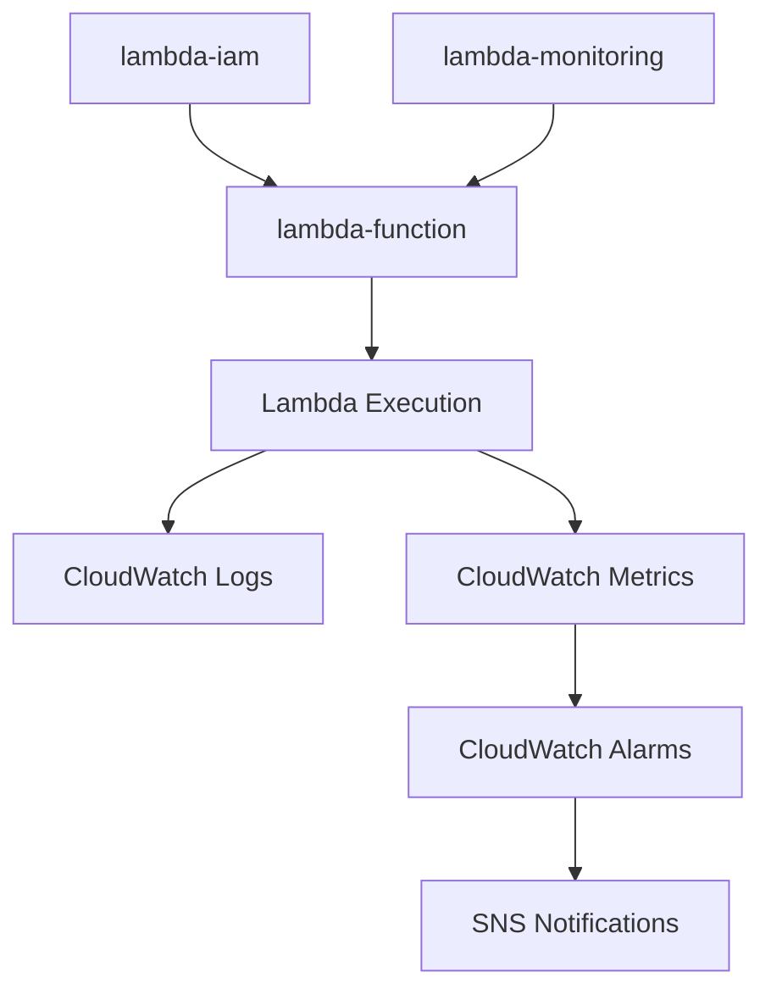

# Terraform Modules for Reporting Lambdas

This directory contains reusable Terraform modules for standardizing infrastructure patterns across reporting lambdas in the monorepo.

## Available Modules

### [lambda-iam](./lambda-iam/)
Standardized IAM roles for Lambda functions with common permissions for S3 access, CloudWatch logging, and X-Ray tracing.

**Key Features:**
- Basic Lambda execution permissions
- Configurable S3 bucket access
- X-Ray tracing support
- Custom policy attachments
- Standardized naming conventions

### [lambda-monitoring](./lambda-monitoring/)
Comprehensive CloudWatch monitoring for Lambda functions including log groups, alarms, and dashboards.

**Key Features:**
- CloudWatch log groups with configurable retention
- Standard alarms (errors, duration, throttles, memory)
- Custom metric alarms
- Optional CloudWatch dashboards
- SNS integration for notifications

### [lambda-function](./lambda-function/)
Complete Lambda function infrastructure with triggers, scheduling, and advanced configuration options.

**Key Features:**
- Full Lambda configuration (runtime, memory, timeout, etc.)
- Event triggers (S3, SQS, API Gateway)
- EventBridge scheduling
- Layer support
- VPC configuration
- Versioning and aliases

## Usage Patterns

### Complete Lambda Stack

The modules are designed to work together to create a complete Lambda infrastructure stack:

```hcl
# 1. Create IAM role
module "lambda_iam" {
  source = "../../terraform/modules/lambda-iam"
  
  lambda_name = var.lambda_name
  s3_bucket_arns = [
    var.input_bucket_arn,
    var.output_bucket_arn
  ]
  tags = var.tags
}

# 2. Create monitoring
module "lambda_monitoring" {
  source = "../../terraform/modules/lambda-monitoring"
  
  lambda_name   = var.lambda_name
  alarm_actions = var.sns_topic_arns
  tags          = var.tags
}

# 3. Create Lambda function
module "lambda_function" {
  source = "../../terraform/modules/lambda-function"

  function_name      = var.lambda_name
  execution_role_arn = module.lambda_iam.role_arn
  package_path       = var.package_path
  
  environment_variables = {
    INPUT_BUCKET  = var.input_bucket_name
    OUTPUT_BUCKET = var.output_bucket_name
    LOG_LEVEL     = var.log_level
  }
  
  layer_arns          = var.layer_arns
  schedule_expression = var.schedule_expression
  
  tags = var.tags
  
  depends_on_resources = [
    module.lambda_iam,
    module.lambda_monitoring
  ]
}
```

### Minimal Lambda

For simple use cases, you can use just the essential modules:

```hcl
module "simple_lambda_iam" {
  source = "../../terraform/modules/lambda-iam"
  
  lambda_name = "simple-processor"
  tags = { Environment = "dev" }
}

module "simple_lambda" {
  source = "../../terraform/modules/lambda-function"

  function_name      = "simple-processor"
  execution_role_arn = module.simple_lambda_iam.role_arn
  package_path       = "dist/simple-processor.zip"
  
  timeout     = 300
  memory_size = 512
  
  tags = { Environment = "dev" }
}
```

## Module Integration

### Data Flow Between Modules



### Output/Input Relationships

| Source Module | Output | Target Module | Input |
|---------------|--------|---------------|-------|
| lambda-iam | `role_arn` | lambda-function | `execution_role_arn` |
| lambda-function | `function_name` | lambda-monitoring | `lambda_name` |
| lambda-monitoring | `log_group_name` | - | Used for log queries |

## Environment-Specific Configurations

### Development Environment

```hcl
# Minimal monitoring, relaxed permissions
module "dev_lambda" {
  source = "../../terraform/modules/lambda-function"
  
  function_name = "${var.lambda_name}-dev"
  # ... other config
  
  # Development-specific settings
  timeout     = 900  # Longer timeout for debugging
  memory_size = 1024 # Moderate memory
  enable_xray = false # Disable X-Ray in dev
}

module "dev_monitoring" {
  source = "../../terraform/modules/lambda-monitoring"
  
  lambda_name = "${var.lambda_name}-dev"
  
  # Disable alarms in development
  enable_error_alarm    = false
  enable_duration_alarm = false
  enable_throttle_alarm = false
}
```

### Production Environment

```hcl
# Full monitoring, strict permissions
module "prod_lambda" {
  source = "../../terraform/modules/lambda-function"
  
  function_name = "${var.lambda_name}-prod"
  # ... other config
  
  # Production-specific settings
  timeout              = 600  # Reasonable timeout
  memory_size         = 2048  # Adequate memory
  reserved_concurrency = 50   # Limit concurrency
  enable_xray         = true  # Enable tracing
  
  # Production alias
  create_alias           = true
  alias_name            = "production"
  alias_function_version = var.lambda_version
}

module "prod_monitoring" {
  source = "../../terraform/modules/lambda-monitoring"
  
  lambda_name = "${var.lambda_name}-prod"
  
  # Strict monitoring in production
  enable_error_alarm     = true
  error_alarm_threshold  = 0
  
  enable_duration_alarm     = true
  duration_alarm_threshold  = 300000  # 5 minutes
  
  alarm_actions = [var.critical_alerts_topic]
  ok_actions    = [var.alerts_topic]
  
  create_dashboard = true
}
```

## Common Environment Variables

### Standard Environment Variables

All reporting lambdas should use these standardized environment variable names:

```hcl
environment_variables = {
  # Data sources and destinations
  INPUT_BUCKET            = var.input_bucket_name
  OUTPUT_BUCKET           = var.output_bucket_name
  OUTPUT_PREFIX           = var.output_prefix
  
  # Processing configuration
  BATCH_SIZE              = var.batch_size
  MAX_RECORDS             = var.max_records
  PROCESSING_MODE         = var.processing_mode
  
  # Logging and monitoring
  LOG_LEVEL               = var.log_level
  POWERTOOLS_SERVICE_NAME = var.lambda_name
  POWERTOOLS_LOG_LEVEL    = var.log_level
  
  # Feature flags
  ENABLE_VALIDATION       = var.enable_validation
  ENABLE_COMPRESSION      = var.enable_compression
  ENABLE_ENCRYPTION       = var.enable_encryption
}
```

### Environment-Specific Variables

```hcl
# Development
environment_variables = merge(local.base_env_vars, {
  LOG_LEVEL = "DEBUG"
  ENABLE_VALIDATION = "false"
  BATCH_SIZE = "10"
})

# Production
environment_variables = merge(local.base_env_vars, {
  LOG_LEVEL = "INFO"
  ENABLE_VALIDATION = "true"
  BATCH_SIZE = "1000"
})
```

## Best Practices

### Module Usage

1. **Always Use IAM Module**: Never create Lambda functions without proper IAM roles
2. **Enable Monitoring**: Use the monitoring module for all production lambdas
3. **Consistent Naming**: Use consistent naming patterns across environments
4. **Tag Everything**: Apply consistent tags to all resources
5. **Environment Separation**: Use separate modules/configurations per environment

### Security

1. **Least Privilege**: Only grant necessary permissions in IAM roles
2. **Specific S3 Access**: Use specific bucket ARNs, not wildcards
3. **VPC When Needed**: Only use VPC configuration when accessing private resources
4. **X-Ray Tracing**: Enable X-Ray in production for debugging
5. **Dead Letter Queues**: Configure DLQs for error handling

### Performance

1. **Right-Size Memory**: Choose appropriate memory based on workload
2. **Optimize Timeout**: Set timeout based on expected execution time
3. **Use Layers**: Leverage layers for shared dependencies
4. **Reserved Concurrency**: Set limits to prevent resource exhaustion
5. **Monitor Cold Starts**: Use aliases and provisioned concurrency if needed

### Cost Optimization

1. **Appropriate Memory**: Don't over-provision memory
2. **Efficient Scheduling**: Use appropriate schedule frequencies
3. **Layer Reuse**: Share layers across multiple functions
4. **Log Retention**: Set appropriate log retention periods
5. **Alarm Thresholds**: Set realistic alarm thresholds to avoid noise

## Migration from Existing Lambdas

### Step-by-Step Migration

1. **Analyze Current Configuration**: Review existing Terraform files
2. **Create IAM Module**: Extract IAM role configuration
3. **Create Monitoring Module**: Extract CloudWatch resources
4. **Create Function Module**: Extract Lambda function configuration
5. **Test in Development**: Deploy to dev environment first
6. **Validate Functionality**: Ensure all features work as expected
7. **Deploy to Production**: Roll out to production environment

### Example Migration

**Before (monolithic configuration):**
```hcl
# All resources in main.tf
resource "aws_iam_role" "lambda_role" { ... }
resource "aws_lambda_function" "function" { ... }
resource "aws_cloudwatch_log_group" "logs" { ... }
resource "aws_cloudwatch_metric_alarm" "errors" { ... }
```

**After (modular configuration):**
```hcl
# Using modules
module "lambda_iam" { ... }
module "lambda_monitoring" { ... }
module "lambda_function" { ... }
```

## Support and Contributions

### Module Development

When developing new modules or enhancing existing ones:

1. Follow the established patterns and naming conventions
2. Include comprehensive documentation and examples
3. Add appropriate validation rules for variables
4. Provide meaningful outputs for integration
5. Test with multiple use cases and environments

### Getting Help

- Review module README files for detailed usage instructions
- Check the examples in each module directory
- Refer to the integration patterns in this document
- Test changes in development environment first